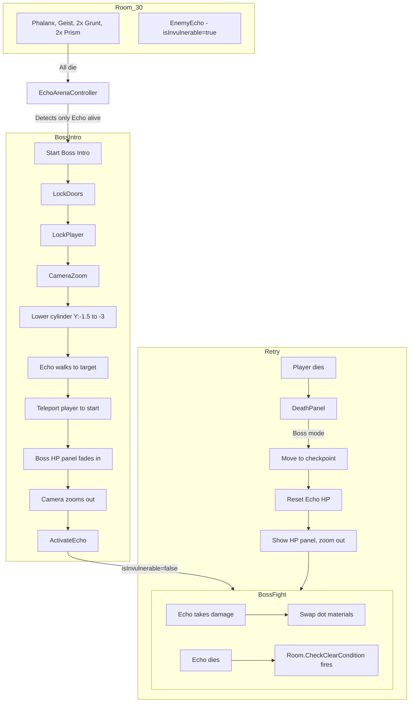

# Echo Boss Encounter — Room_30 Final Architecture

## Overview

Echo is a child of Room_30 and appears in the enemy list. The room only clears when
Echo dies. An `EchoArenaController` manages the transition phases.

---

## Existing Systems

| System | File |
|--------|------|
| ScoreManager | [`ScoreManager.cs`](Assets/Scripts/ScoreManager.cs) |
| DeathPanel | [`DeathPanelController.cs`](Assets/Scripts/UI/DeathPanelController.cs) |
| PreGamePanel | [`PreGamePanel.cs`](Assets/Scripts/UI/PreGamePanel.cs) |
| Room | [`Room.cs`](Assets/Scripts/Rooms/Room.cs) |
| EnemyEcho | [`EnemyEcho.cs`](Assets/Scripts/Enemies/EnemyEcho.cs) |

---

## Phase 1: Normal Enemies

Echo is in the room's enemy list. It starts with `isInvulnerable = true`
so the player can't damage it. Echo's AI is suppressed by keeping it frozen
or simply not calling `HandleBehavior` via a flag.

Normal enemies fight as usual. As they die, `EchoArenaController` tracks the
room's enemy list. When **only Echo remains alive**, it triggers the boss intro.

The room's `CheckClearCondition` won't fire because Echo is still alive.
`EchoArenaController` manually locks doors and takes over.

## Phase 2: Boss Intro Sequence

Sequence driven by `EchoArenaController` coroutine:

```
1. All normal enemies dead → EchoArenaController detects this
2. Doors permanently locked (via EchoArenaController, not Room)
3. Player movement locked + brief invulnerability
4. Camera pan + zoom to Echo (cinematic)
5. Cylinder below Echo lowers (Y: -1.5 → -3, lerp animation)
6. Echo walks to a target position (transform reference)
7. Player teleported to starting position (transform reference)
8. Camera still focused on Echo
9. Boss HP panel fades in (3 dots with material swap)
10. Camera zooms out to normal gameplay position
11. Player unlocked
12. Echo.isInvulnerable = false, Echo activates (starts attacking)
```

## Phase 3: Boss Fight

- Echo fights with existing AI
- `EchoArenaController.OnEchoDamaged(int hp)` updates dot materials
- When Echo dies → normal `Room.CheckClearCondition` fires (Echo is dead) → room clears → doors unlock

## Phase 4: Retry (Death During Boss Fight)

In-place respawn (no scene reload):
1. Player moved to checkpoint position
2. Player health reset
3. Echo health reset to 3, `isInvulnerable = false`
4. HP panel shows up (skip cylinder lowering, walk, camera pan)
5. Camera zooms out to normal position
6. Fight resumes

Score preserved, enemy corpses preserved (no scene reload).

---

## Key Changes Needed

### Room.cs — `CheckClearCondition` override for boss room
The room won't clear until Echo dies (since Echo is in the enemy list).
But `EchoArenaController` needs to detect when non-Echo enemies are all dead.

**Approach:** Echo has a new `isBoss` flag or tag. `EchoArenaController` subscribes
to each enemy's `OnDeath` event and counts down.

### EnemyEcho.cs — Boss phase control
- New public method `BeginEncounter()` — enables AI, sets `isInvulnerable = false`
- New public method `ResetForRetry()` — resets health, state
- The existing `HandleBehavior()` is already gated by `CanAggro()` which checks
  `RoomManager.Instance.CurrentRoom`. As long as the player is in the room, this
  works. During the intro, the player is in the room but movement is locked.

### DeathPanelController.cs — Boss retry path
Instead of `SceneManager.LoadScene`, check for boss fight mode:
```csharp
if (EchoArenaController.IsBossActive)
    EchoArenaController.Instance.RespawnForRetry();
else
    SceneManager.LoadScene(...);
```

---

## Data Flow



---

## Todo List

### New Script: `EchoArenaController.cs`
- Detect when only Echo remains alive in Room_30
- Lock/unlock doors
- Play boss intro coroutine
- Manage HP UI dots
- Handle retry/respawn
- Public static `Instance` + `IsBossActive`

### Modify: `EnemyEcho.cs`
- Add `BeginEncounter()` method
- Add `ResetForRetry()` method
- `_isStunned` flag needs to be overridable for boss phase start

### Modify: `DeathPanelController.cs`
- Add boss retry path (no scene reload)

### New Script: `BossHPUI.cs`
- Manages the 3-dot panel with material swapping
- Public `UpdateHP(int currentHP, int maxHP)`

### Scene Setup (Room_30 Inspector)
- Assign references: Echo, Cylinder, walk target, player start, checkpoint
- Assign UI panel references
- Assign materials for HP dots
