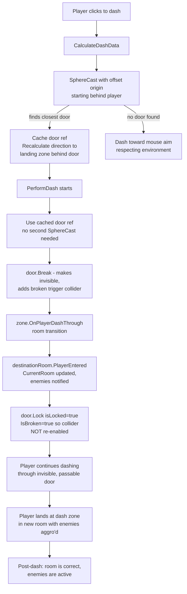

# Fix Door Dash & Room Transition Bugs

## Three-State Door Model

Per discussion, the door has exactly 3 states:

| State | Visual | Collision | Dash Behavior |
|-------|--------|-----------|---------------|
| **Locked** | Visible, red | Solid (can't walk through) | Dash does nothing |
| **Closed** | Visible, original color | Solid (can't walk through) | Dash breaks it → room transition |
| **Open** | Invisible | No collision (walk through) | N/A |

> *When you enter a room, all doors in it should be locked — no exceptions.*

---

## Root Causes of All Bugs

### Bug A: Door "Resurrects" While Player Is Mid-Dash

[`Door.Lock()`](Assets/Scripts/Door.cs:88-105) does this:
```csharp
public void Lock()
{
    isLocked = true;
    // ...
    if (_col != null) _col.enabled = true;  // <-- Re-enables solid collider!
    // Doesn't check IsBroken
}
```

**Flow:**
1. Player dashes → door breaks → `IsBroken = true`, `_col.enabled = false`
2. Room transition → `LockRoom()` → `door.Lock()` on all doors including this one
3. `Lock()` re-enables `_col.enabled = true` even though `IsBroken = true`
4. Player is mid-dash while the solid collider suddenly reappears around them
5. Unity physics **ejects** the player to resolve the overlap → player thrown backward

This causes: *"Sometimes I'm still outside the room and the door is already locked"* and contributes to *"enemies don't detect me"* (because the player got pushed back out).

**Fix:** Guard `Lock()` so broken doors never re-solidify:
```csharp
public void Lock()
{
    isLocked = true;
    if (IsBroken)
    {
        // Broken doors stay invisible and non-solid — just flag them as locked
        if (doorRenderer != null) doorRenderer.enabled = false;
        // Don't touch the collider
        return;
    }
    // Normal (non-broken) door locking logic...
    if (doorRenderer != null)
    {
        doorRenderer.enabled = true;
        doorMaterialInstance.color = Color.red;
    }
    if (_col != null) _col.enabled = true;
}
```

---

### Bug B: SphereCast Misses Door When Player Hugs It

[`GetDoorInDashPath()`](Assets/Scripts/PlayerDash.cs:531-542) uses `Physics.SphereCastAll`:
```csharp
RaycastHit[] hits = Physics.SphereCastAll(transform.position, hitRadius, dir, Mathf.Max(dist, 2f));
```

When the player is right up against the door (e.g., dashed to it and didn't move), the **sphere cast origin is inside the door's collider**. Unity's physics completely ignores colliders when the cast starts inside them. The door is not detected, so:
- No `Break()` is called
- No `OnPlayerDashThrough()` is called
- No room transition happens
- Player phases through the door but `CurrentRoom` stays the old one
- Enemies' `CanAggro()` returns false — they never detect the player

**Fix:** Offset the sphere cast origin backward by `hitRadius` so it always starts outside:
```csharp
Vector3 origin = transform.position - dir.normalized * hitRadius;
RaycastHit[] hits = Physics.SphereCastAll(origin, hitRadius, dir, Mathf.Max(dist, 2f) + hitRadius);
```

---

### Bug C: Wrong Door Selected When Two Are Close

`SphereCastAll` returns results in **arbitrary order** — not sorted by distance. The code returns the **first** door found, not the **closest** one:
```csharp
foreach (var hit in hits)
{
    if (hit.collider.TryGetComponent(out Door door) && !door.IsBroken)
        return door;  // First, not closest!
}
```

**Fix:** Track closest distance and return the nearest door:
```csharp
Door closestDoor = null;
float closestDist = float.MaxValue;
foreach (var hit in hits)
{
    if (hit.collider.TryGetComponent(out Door door) && !door.IsBroken && hit.distance < closestDist)
    {
        closestDoor = door;
        closestDist = hit.distance;
    }
}
return closestDoor;
```

---

### Bug D: Redundant Double Detection Makes System Fragile

`GetDoorInDashPath()` is called **twice**:
1. In [`CalculateDashData()`](Assets/Scripts/PlayerDash.cs:166) — to redirect dash toward landing zone
2. In [`PerformDash()`](Assets/Scripts/PlayerDash.cs:237) — to detect and break the door

Between these two calls, `_dashDirection` and `_dashDistance` are recalculated (pointing to the landing zone behind the door). The second call uses different parameters and could get different results.

**Fix:** Cache the detected door reference in `CalculateDashData()` and reuse it in `PerformDash()`. Eliminate the second call entirely.

---

## Summary of Changes

### File: [`Assets/Scripts/Door.cs`](Assets/Scripts/Door.cs)
| Change | Lines | What |
|--------|-------|------|
| Fix `Lock()` | 88-105 | Skip collider re-enable when `IsBroken` |

### File: [`Assets/Scripts/PlayerDash.cs`](Assets/Scripts/PlayerDash.cs)
| Change | Lines | What |
|--------|-------|------|
| Fix `GetDoorInDashPath()` | 531-542 | Sort by distance, pick closest door |
| Fix SphereCast origin | 531-542 | Offset backward by `hitRadius` |
| Cache door ref | ~166-180 | Store found door, don't re-detect in `PerformDash()` |
| Remove second call | ~237 | Use cached door instead of calling `GetDoorInDashPath` again |

---

## Execution Order

1. **Door.Lock() fix** — prevents physics ejection (most impactful)
2. **GetDoorInDashPath closest-door fix** — prevents wrong-room dash
3. **SphereCast origin offset** — prevents missed detection when hugging door
4. **Cache door ref + remove double call** — eliminates fragility

---

## What the Fixed Flow Looks Like



---

## Edge Cases This Solves

| Scenario | Before | After |
|----------|--------|-------|
| Dash while hugging door | Door missed, no transition | Offset cast finds it |
| Dash near 2 doors | Random wrong door | Closest door selected |
| Dash breaks door, room locks | Solid collider reappears, player ejected | Collider stays off |
| Fast dash through room | Inconsistent detection | Single cached detection |
| Player walks back through broken door after room cleared | Trigger fires (unlocked = passable) | Same — still works |
