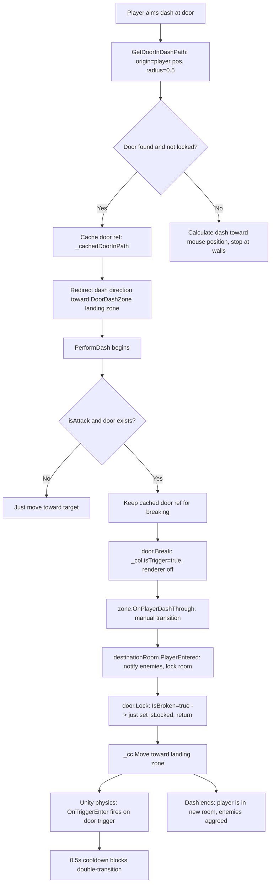

# Fix Door Dash & Room Transition Bugs — Architect-Reviewed Plan

## Summary

After reading the current code, Gemini's proposed changes overlap significantly with fixes already partially applied. However, the **core remaining bug** is that [`Door.Break()`](Assets/Scripts/Rooms/Door.cs:54-71) creates a new `BoxCollider` (default 1×1×1) instead of reusing the existing collider. This tiny trigger causes the player to miss it entirely at dash speed. A secondary bug is the backward offset in [`GetDoorInDashPath()`](Assets/Scripts/PlayerDash.cs:535) that detects doors behind the player.

---

## Root Cause Analysis

### Bug 1: Dash goes to wrong room when doors are close together

**Root cause:** [`GetDoorInDashPath()`](Assets/Scripts/PlayerDash.cs:533-549) line 535:
```csharp
Vector3 origin = transform.position - dir * hitRadius;
```
The SphereCast origin is offset **1 unit behind the player** (when `hitRadius = 1.0`). This means if there's a door close behind the player, the SphereCast can detect it before the door in front. The backward offset was originally added to prevent "hugging a door" detection failure, but it created a worse bug.

**Fix:** Remove the backward offset. Use `transform.position` directly. Reduce `hitRadius` to `0.5f` for door detection specifically (not for combat hit radius).

### Bug 2: Dash through door → not placed at landing zone / enemies don't react

**Root cause:** [`Door.Break()`](Assets/Scripts/Rooms/Door.cs:54-71) line 66:
```csharp
_brokenTrigger = gameObject.AddComponent<BoxCollider>();
_brokenTrigger.isTrigger = true;
```
This creates a 1×1×1 trigger at the door's local origin. If the door mesh is larger (e.g., 3×4×0.5), the trigger is **tiny** compared to the door. The player dashes through and the trigger is so small they never touch it. The manual [`zone.OnPlayerDashThrough()`](Assets/Scripts/PlayerDash.cs:255) call DOES fire the room transition, but the tiny trigger means walking back through the door opening doesn't hit it either — until the player happens to step exactly on the 1×1×1 spot.

The "enemies don't attack" symptom happens because the door detection itself was wrong (Bug 1) — the player transitioned to the **wrong room**, not because enemies failed to detect.

**Fix:** Instead of creating a new BoxCollider, just toggle `_col.isTrigger = true` on the existing collider. This guarantees the trigger matches the door mesh exactly.

### Bug 3: Walk back to open door → door "locks" and enemies attack

This is the same root cause as Bug 2. The 1×1×1 trigger is so small that walking back doesn't immediately trigger it. When the player eventually steps on the tiny trigger spot, [`DoorDashZone.OnTriggerEnter()`](Assets/Scripts/Rooms/DoorDashZone.cs:31) fires again (because the room's [`LockRoom()`](Assets/Scripts/Rooms/Room.cs:99-103) calls [`door.Lock()`](Assets/Scripts/Rooms/Door.cs:88-108) which sets `isLocked = true` on all doors including this one, but when the player walks back, the room hasn't been re-entered). Wait — actually, re-reading the flow:

1. Dash breaks door → trigger is 1×1×1 → manual transition fires → room locks
2. Player walks back toward the open door
3. Player's collider is bigger than 1×1×1, so they might **miss** the tiny trigger
4. At some point they step on it → `OnTriggerEnter` fires → `TransitionToNextRoom` → goes to the OTHER room → THAT room's `PlayerEntered()` fires and locks THAT room → enemies in THAT room now detect the player

So the "enemies attack when walking back" is actually: the player transitions BACK to the room they dashed from, and the enemies in THAT room detect them.

---

## Fix Plan

### Fix 1: [`Door.Break()`](Assets/Scripts/Rooms/Door.cs:54-71) — Use existing collider as trigger

**What:** Replace the `AddComponent<BoxCollider>()` with `_col.isTrigger = true`.

**Why:** The existing collider is the correct size. New BoxCollider defaults to 1×1×1.

```csharp
public void Break()
{
    if (isLocked || IsBroken) return;
    
    IsBroken = true;

    if (doorRenderer != null) doorRenderer.enabled = false;
    
    // REUSE the existing collider as a trigger instead of creating a new tiny one
    if (_col != null) 
    {
        _col.isTrigger = true;
    }

    PlayBreakEffects();
}
```

### Fix 2: Remove [`_brokenTrigger`](Assets/Scripts/Rooms/Door.cs:34) field entirely

**What:** Delete `private Collider _brokenTrigger;` — it's no longer needed since we reuse `_col`.

### Fix 3: [`Door.Lock()`](Assets/Scripts/Rooms/Door.cs:88-108) — Already has `IsBroken` guard, but remove the debug log

**What:** The `IsBroken` guard is already in place (lines 92-97). Remove the noisy debug log on line 99.

### Fix 4: [`Door.Unlock()`](Assets/Scripts/Rooms/Door.cs:110-133) — Handle broken doors as triggers

**What:** For broken doors in `Unlock()`, keep the collider as a trigger (not disabled):

```csharp
if (IsBroken)
{
    if (doorRenderer != null) doorRenderer.enabled = false;
    if (_col != null) 
    {
        _col.enabled = true;
        _col.isTrigger = true;  // Stay passable as a trigger
    }
}
```

Currently it disables `_col` entirely for broken doors. Since broken doors no longer have a separate `_brokenTrigger`, we need `_col` to stay enabled as a trigger.

### Fix 5: [`GetDoorInDashPath()`](Assets/Scripts/PlayerDash.cs:533-549) — Remove backward offset, reduce radius

**What:** Use `transform.position` directly (no backward offset). Use a narrower `doorDetectionRadius` (0.5f) separate from `hitRadius`. Keep the closest-door logic.

```csharp
private float doorDetectionRadius = 0.5f;

Door GetDoorInDashPath(Vector3 dir, float dist)
{
    float castDist = Mathf.Max(dist, 2f);
    RaycastHit[] hits = Physics.SphereCastAll(transform.position, doorDetectionRadius, dir, castDist);
    Door closestDoor = null;
    float closestDist = float.MaxValue;
    
    foreach (var hit in hits)
    {
        if (hit.collider.TryGetComponent(out Door door) && !door.IsBroken && hit.distance < closestDist)
        {
            closestDoor = door;
            closestDist = hit.distance;
        }
    }
    return closestDoor;
}
```

### Fix 6: Remove `Physics.IgnoreCollision` hack from [`PerformDash()`](Assets/Scripts/PlayerDash.cs:250-251, 372)

**What:** Remove lines 250-251 and line 372. Since broken doors are triggers (not solid), and `Lock()` returns early for broken doors (not re-enabling solid colliders), there's nothing to collide with.

### Fix 7: Keep manual [`zone.OnPlayerDashThrough()`](Assets/Scripts/PlayerDash.cs:255) call

**Why we KEEP this:** At dash speed (40 units/sec), the player crosses the door in ~0.012s. If Unity's trigger detection queues events for the next physics step, the player can be past the door before `OnTriggerEnter` fires. The manual call guarantees the transition happens immediately. The correctly-sized trigger then serves as a backup for walk-speed transitions.

### Fix 8: [`DoorDashZone.OnTriggerEnter()`](Assets/Scripts/Rooms/DoorDashZone.cs:21-36) — Replace time cooldown with dashing-state check

**Problem:** The `_lastTransitionTime` cooldown (0.5s) in [`TransitionToNextRoom()`](Assets/Scripts/Rooms/DoorDashZone.cs:40) blocks ALL transitions through a door for 0.5s after any transition — including legitimate walk-through transitions to a **different** room. When the cooldown blocks the transition, the room never officially changes, enemies don't aggro, and the player walks freely through an "unlocked" door.

**Timeline of the bug:**
1. Player dashes from Room_9 through `Door_To_Room_10` → `else` fallback dumps them in Room_8 → `_lastTransitionTime = now`
2. Player walks through the same broken door from Room_8 to Room_10 (0.1s later) → **cooldown blocks the transition**
3. RoomManager still thinks player is in Room_8 → enemies in Room_10 check [`CanAggro()`](Assets/Scripts/Enemies/EnemyBase.cs:111-114): `CurrentRoom (Room_8) != _myRoom (Room_10)` → false → never attack
4. Player walks back ~0.4s later → cooldown expired → transition finally fires → enemies aggro

**Fix:** Replace the time cooldown with a player-dashing check. If the player is mid-dash when `OnTriggerEnter` fires, the manual [`OnPlayerDashThrough()`](Assets/Scripts/Rooms/DoorDashZone.cs:16-18) already handled the transition — skip the trigger. If not dashing, allow the transition through.

```csharp
private void OnTriggerEnter(Collider other)
{
    if (other.CompareTag("Player"))
    {
        // If player is mid-dash, OnPlayerDashThrough() already handled the transition.
        // Skip to prevent double-transition back to the previous room.
        PlayerDash playerDash = other.GetComponent<PlayerDash>();
        if (playerDash != null && playerDash.IsPlayerDashing()) return;

        Door door = GetComponent<Door>();
        if (door != null && door.IsBroken && !door.IsLocked())
        {
            TransitionToNextRoom();
        }
    }
}
```

Remove the `_lastTransitionTime` field and its cooldown check from `TransitionToNextRoom()` — the dashing-state guard replaces it.

---

## Files Changed & Execution Order

| Step | File | What |
|------|------|------|
| 1 | [`Door.cs`](Assets/Scripts/Rooms/Door.cs) | [`Break()`](Assets/Scripts/Rooms/Door.cs:54-71): Use `_col.isTrigger = true` instead of new BoxCollider |
| 2 | [`Door.cs`](Assets/Scripts/Rooms/Door.cs) | Remove `_brokenTrigger` field (line 34), all references, delete dead code |
| 3 | [`Door.cs`](Assets/Scripts/Rooms/Door.cs) | [`Lock()`](Assets/Scripts/Rooms/Door.cs:88-108): Remove noisy debug log |
| 4 | [`Door.cs`](Assets/Scripts/Rooms/Door.cs) | [`Unlock()`](Assets/Scripts/Rooms/Door.cs:110-133): Broken path keeps `_col.isTrigger = true` instead of disabling collider |
| 5 | [`PlayerDash.cs`](Assets/Scripts/PlayerDash.cs) | Add `doorDetectionRadius = 0.5f` field |
| 6 | [`PlayerDash.cs`](Assets/Scripts/PlayerDash.cs) | [`GetDoorInDashPath()`](Assets/Scripts/PlayerDash.cs:533-549): Remove backward offset, use `doorDetectionRadius` |
| 7 | [`PlayerDash.cs`](Assets/Scripts/PlayerDash.cs) | [`PerformDash()`](Assets/Scripts/PlayerDash.cs:250-251, 372): Remove `Physics.IgnoreCollision` calls |
| 8 | [`DoorDashZone.cs`](Assets/Scripts/Rooms/DoorDashZone.cs) | Replace `_lastTransitionTime` cooldown with `IsPlayerDashing()` guard in `OnTriggerEnter` |

---

## What This Does NOT Change

- The 3-state door model (Locked / Closed / Open)
- The manual `zone.OnPlayerDashThrough()` call — kept as a safety net
- The cached door ref logic (`_cachedDoorInPath`) — already working
- Room transition flow in [`Room.cs`](Assets/Scripts/Rooms/Room.cs)
- Enemy aggro logic
- No new components, no prefab changes

---

## Mermaid Diagram: Fixed Flow



---

## Risk Assessment

| Risk | Likelihood | Mitigation |
|------|-----------|------------|
| OnTriggerEnter fires during dash despite 0.5s cooldown | Low | Cooldown is checked at the start of `TransitionToNextRoom()` |
| Edge case: player exactly at door edge → SphereCast barely misses | Low | `doorDetectionRadius = 0.5` gives 1m total width, wider than any player |
| Existing broken doors in scenes still have the `_brokenTrigger` component | Medium | `_brokenTrigger` was added via `AddComponent` at runtime, so it only exists in memory. No scene serialization issues. Restart clears it. |
| Other systems (e.g., enemies, AI) depend on `Door._brokenTrigger` existing | None | `_brokenTrigger` is only referenced inside Door.cs itself |
