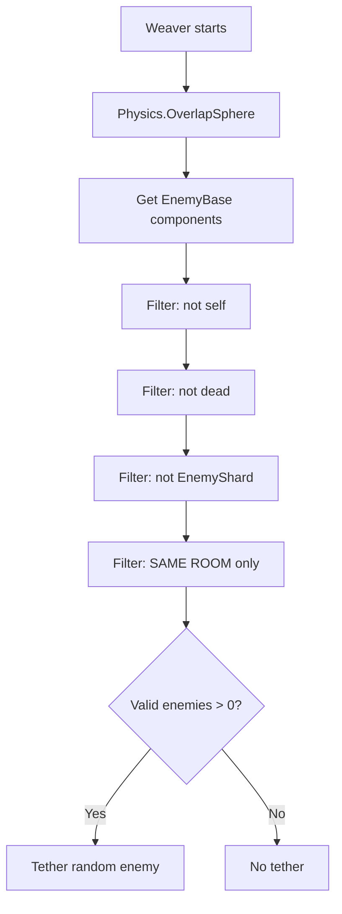

# Fix EnemyWeaver Cross-Room Tethering

## Problem

[`EnemyWeaver.FindAndTetherEnemy()`](Assets/Scripts/Enemies/EnemyWeaver.cs:67) uses `Physics.OverlapSphere` which can detect enemies in **adjacent rooms** (through thin walls, near doorways). The Weaver should **only tether enemies in its own room**.

## Root Cause

The method has **no room filter** — it just checks physics proximity and basic validity (not self, not dead, not EnemyShard). Any enemy within `tetherRange = 20f` that passes those checks can be tethered, even if they're in a different room.

## Fix

### 1. [`EnemyBase.cs`](Assets/Scripts/Enemies/EnemyBase.cs) — Add public `MyRoom` property

Expose the existing `protected Room _myRoom` field so other scripts can read it:

```csharp
public Room MyRoom => _myRoom;
```

### 2. [`EnemyWeaver.cs`](Assets/Scripts/Enemies/EnemyWeaver.cs) — Add same-room filter

Add a `.Where()` clause to [`FindAndTetherEnemy()`](Assets/Scripts/Enemies/EnemyWeaver.cs:73) that checks the candidate enemy is in the same room:

```csharp
.Where(enemy => enemy.MyRoom == _myRoom)
```

## Flow



## Edge Cases

| Case | Behavior |
|------|----------|
| Enemy in adjacent room within range | Filtered out by `enemy.MyRoom == _myRoom` |
| Enemy has no room assigned (`_myRoom == null`) | `null == null` would pass — but this shouldn't happen since `Room.AssignRoom()` is called in `Room.Awake()` before the Weaver runs |
| Weaver itself has no room | `_myRoom == null` → all `enemy.MyRoom == null` comparisons would include unassigned enemies |
