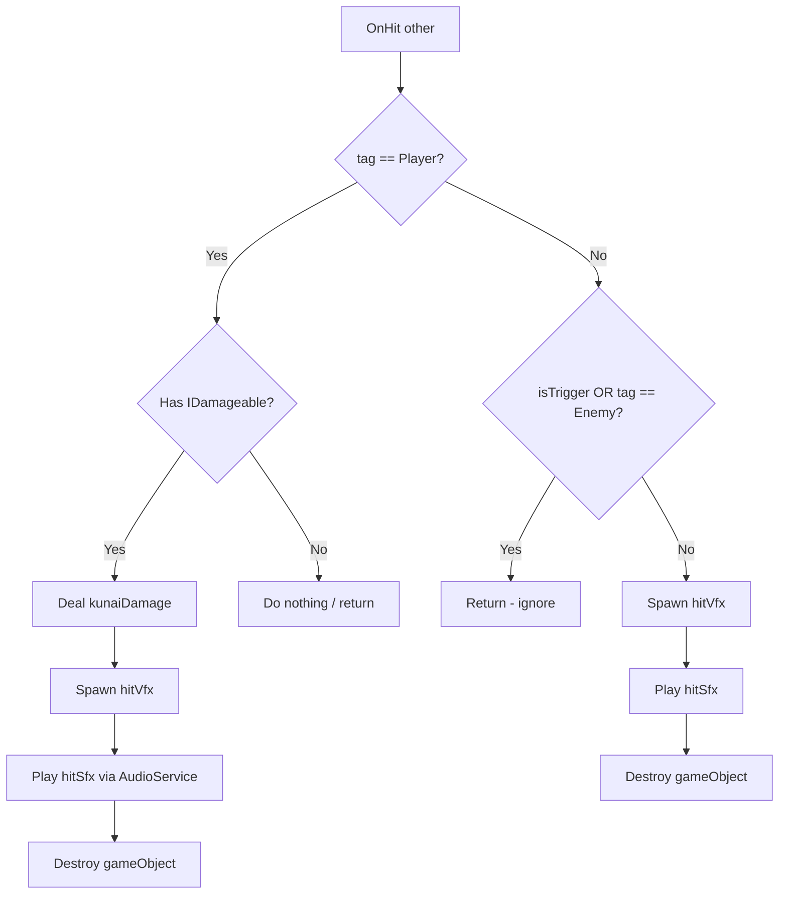
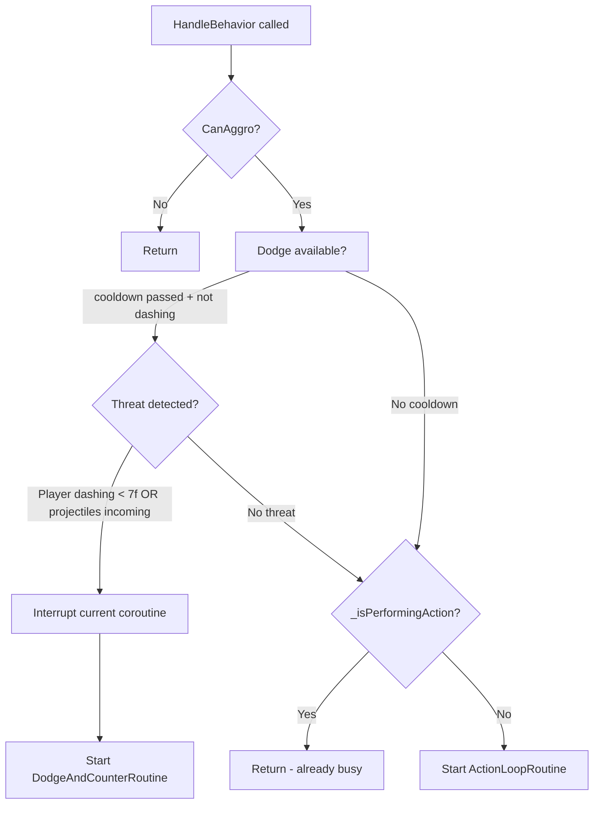
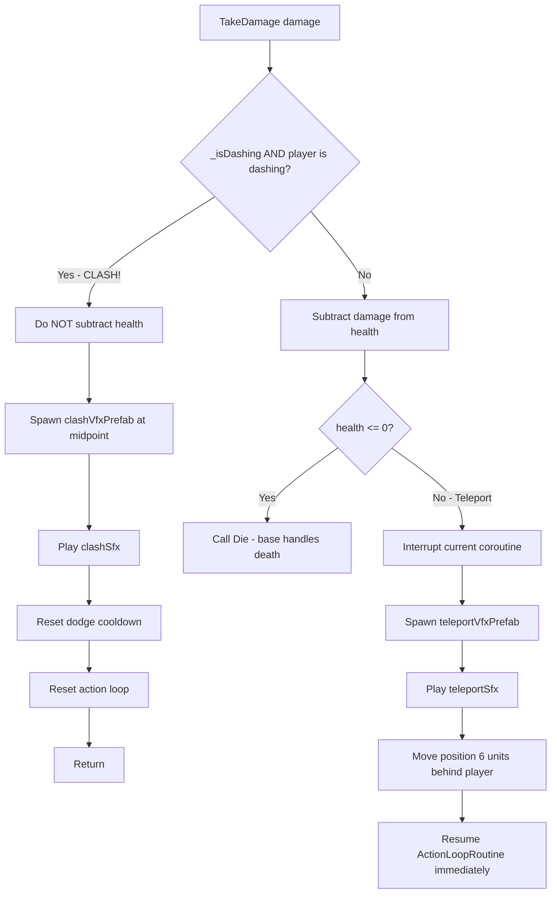
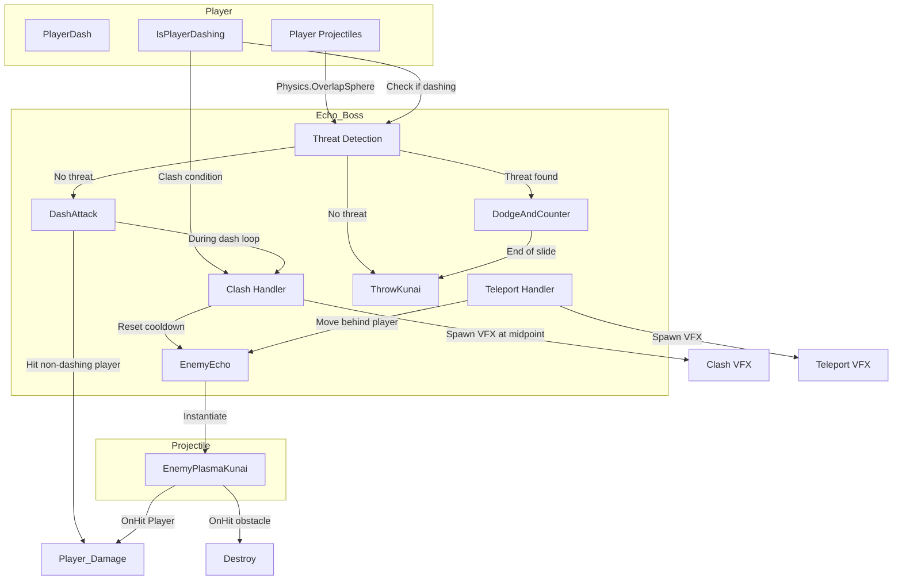

# Echo Boss Implementation Plan

## Overview

Create two scripts for the "Echo" boss fight — a perfect player clone that tests reaction speed. The boss uses a dodge-counter AI loop, high-speed dash attacks, thrown kunai, a clash mechanic, and teleport-on-hit to keep pressure on the player.

---

## Task 1: `EnemyPlasmaKunai.cs` (Projectile)

### Location
`Assets/Scripts/Projectiles/EnemyPlasmaKunai.cs`

### Architecture & Integration Points

- **Inherits from:** [`BaseProjectile`](Assets/Scripts/Projectiles/BaseProjectile.cs:9)
  - Must `require` a [`BoxCollider`](Assets/Scripts/Projectiles/PlasmaKunaiProjectile.cs:3) (matching the player's kunai pattern)
  - Must override abstract [`OnHit(Collider other)`](Assets/Scripts/Projectiles/BaseProjectile.cs:81)
- **Key issue:** The base class [`BaseProjectile.Move()`](Assets/Scripts/Projectiles/BaseProjectile.cs:43) uses a raycast that **skips** "Player" tagged objects. The base class [`OnTriggerEnter()`](Assets/Scripts/Projectiles/BaseProjectile.cs:62) also **skips** "Player" tagged objects.
  - **Overrides needed:** [`OnTriggerEnter`](Assets/Scripts/Projectiles/BaseProjectile.cs:62) to handle Player hits
- **Audio:** Uses [`AudioService.PlayClip(...)`](Assets/Scripts/Audio/AudioService.cs:75) (3D world sound)
- **Damage interface:** Uses [`IDamageable`](Assets/Scripts/IDamageable.cs:4)

### Fields

| Field | Type | Default | Purpose |
|-------|------|---------|---------|
| `hitVfx` | `GameObject` | `null` | Spawned on any hit |
| `hitSfx` | `AudioClip` | `null` | Played on any hit |
| `kunaiDamage` | `int` | `1` | Damage dealt to player |

### Logic (OnHit override)



### Override Notes

1. **Override [`OnTriggerEnter`](Assets/Scripts/Projectiles/BaseProjectile.cs:62):** The base class skips "Player". We override to call `OnHit` even for Player hits.
2. **In [`OnHit`](Assets/Scripts/Projectiles/BaseProjectile.cs:81):** Check `other.CompareTag("Player")` first. If player + `IDamageable`, deal damage. Otherwise, if non-trigger + non-Enemy, treat as obstacle hit.

---

## Task 2: `EnemyEcho.cs` (Boss Enemy)

### Location
`Assets/Scripts/Enemies/EnemyEcho.cs`

### Architecture & Integration Points

- **Inherits from:** [`EnemyBase`](Assets/Scripts/Enemies/EnemyBase.cs:12) (which implements [`IDamageable`](Assets/Scripts/IDamageable.cs:4))
  - Has [`_agent`](Assets/Scripts/Enemies/EnemyBase.cs:30) (NavMeshAgent), [`_animator`](Assets/Scripts/Enemies/EnemyBase.cs:32), [`health`](Assets/Scripts/Enemies/EnemyBase.cs:15)
  - Has [`SetKatanaVisible(bool)`](Assets/Scripts/Enemies/EnemyBase.cs:84), [`GetTarget()`](Assets/Scripts/Enemies/EnemyBase.cs:113), [`ShouldAbortAttack(Transform)`](Assets/Scripts/Enemies/EnemyBase.cs:55)
  - Abstract [`HandleBehavior()`](Assets/Scripts/Enemies/EnemyBase.cs:223) called every Update
  - Virtual [`TakeDamage(int damage)`](Assets/Scripts/Enemies/EnemyBase.cs:229) — overridden for Clash + Teleport
  - Virtual [`Die()`](Assets/Scripts/Enemies/EnemyBase.cs:242) — base handles death VFX, SFX, score, animation
- **Player interaction:** Uses [`PlayerDash.IsPlayerDashing()`](Assets/Scripts/PlayerDash.cs:529) for clash and dodge detection
- **Projectile detection:** Uses `Physics.OverlapSphere` with a `playerProjectileLayer` LayerMask to detect incoming threats
- **Audio:** Uses [`AudioService.PlayClip(...)`](Assets/Scripts/Audio/AudioService.cs:75) for all SFX
- **Pattern reference:** [`EnemyRusher.DashAttack()`](Assets/Scripts/Enemies/EnemyRusher.cs:57) — dash movement loop with `Physics.OverlapSphere` for player detection and clash check

### Variables & Setup

| Category | Field | Type | Default | Notes |
|----------|-------|------|---------|-------|
| Setup | `_playerDash` | `PlayerDash` | — | Cached in Awake via "Player" tag |
| State | `_isPerformingAction` | `bool` | `false` | Gates coroutine entry |
| State | `_isDashing` | `bool` | `false` | Tracks dash state for clash detection |
| State | `_currentRoutine` | `Coroutine` | — | Current active coroutine for interruption |
| Dash | `dashSpeed` | `float` | `40f` | Speed during dash attack |
| Dash | `dashRange` | `float` | `5f` | How far Echo dashes |
| Dash | `dashWindup` | `float` | `0.15f` | Windup before dash |
| Dodge | `dodgeCooldown` | `float` | `1.5f` | Cooldown between dodges |
| Dodge | `dodgeDistance` | `float` | `4f` | How far Echo slides back |
| Dodge | `dodgeSpeed` | `float` | `30f` | Speed of dodge slide |
| Dodge | `_lastDodgeTime` | `float` | `-99f` | Tracks dodge cooldown |
| Arsenal | `enemyKunaiPrefab` | `GameObject` | — | EnemyPlasmaKunai prefab to throw |
| Arsenal | `throwPoint` | `Transform` | — | Where kunai spawns |
| VFX | `clashVfxPrefab` | `GameObject` | — | Spawned at midpoint on clash |
| SFX | `clashSfx` | `AudioClip` | — | Played on clash |
| VFX | `teleportVfxPrefab` | `GameObject` | — | Spawned on teleport |
| SFX | `teleportSfx` | `AudioClip` | — | Played on teleport |
| Detection | `playerProjectileLayer` | `LayerMask` | — | Layer for detecting player projectiles |

### Awake

```csharp
protected override void Awake()
{
    base.Awake();                          // Sets up _agent, _rb, _animator, _defaultTarget
    SetKatanaVisible(false);                // Sword holstered by default
    GameObject player = GameObject.FindGameObjectWithTag("Player");
    if (player != null) _playerDash = player.GetComponent<PlayerDash>();
}
```

### The "Option B" AI Loop (HandleBehavior)



**Threat Detection Logic:**
```csharp
// Condition 1: Player is dashing toward Echo
bool playerIsDashing = _playerDash != null && _playerDash.IsPlayerDashing();
float distToPlayer = Vector3.Distance(transform.position, target.position);
bool playerDashingNearby = playerIsDashing && distToPlayer < 7f;

// Condition 2: Player projectiles in proximity
bool projectilesIncoming = false;
Collider[] nearbyColliders = Physics.OverlapSphere(transform.position, detectRange, playerProjectileLayer);
foreach (var col in nearbyColliders)
{
    if (col.TryGetComponent(out BaseProjectile _))
    {
        projectilesIncoming = true;
        break;
    }
}
```

### DodgeAndCounterRoutine

1. Stop NavMeshAgent: `_agent.isStopped = true; _agent.ResetPath();`
2. Set `_isPerformingAction = true`
3. Record `_lastDodgeTime = Time.time`
4. Calculate backward direction (away from player)
5. Move backward via `while` loop over `dodgeDistance` at `dodgeSpeed`
6. At the end of the slide, **immediately throw a kunai** (call `ThrowKunaiRoutine`)
7. Reset `_isPerformingAction = false`

### DashAttackRoutine

1. Stop NavMeshAgent, `SetKatanaVisible(true)`, set `_isPerformingAction = true`
2. Look at player, wait `dashWindup` seconds
3. Set `_isDashing = true`, trigger `dashTrigger` animation
4. Calculate dash direction toward player
5. `while` loop moving forward until `dashRange` is reached
   - Each frame: `transform.position += direction * dashSpeed * Time.deltaTime`
   - Use `Physics.OverlapSphere` to check if player is hit
   - If player hit AND `_playerDash.IsPlayerDashing()` — this is actually a clash, handled in TakeDamage
   - If player hit but NOT dashing — deal damage via `IDamageable`
6. After loop: `SetKatanaVisible(false)`, `_isDashing = false`, `_isPerformingAction = false`

### ThrowKunaiRoutine

1. Look at player
2. Instantiate `enemyKunaiPrefab` at `throwPoint.position` with rotation toward player
3. Set direction and speed on the projectile's Rigidbody (or let BaseProjectile's Move handle it)
4. Short cooldown / yield return

### ActionLoopRoutine

1. Set `_isPerformingAction = true`
2. Face the player
3. Roll: if `Random.value < 0.8f` → `DashAttackRoutine` else → `ThrowKunaiRoutine`
4. After action completes, set `_isPerformingAction = false`

### The "Clash" Mechanic (Override TakeDamage)



**Clash Details:**
- Midpoint calculation: `Vector3 midpoint = (transform.position + target.position) * 0.5f`
- Echo takes **zero damage**
- The dodge cooldown is reset so Echo immediately becomes evasive again
- The action loop is reset so Echo keeps attacking

**Teleport Details (health > 0 after damage):**
- Stop any active coroutine via `StopCoroutine`
- Instantiate teleport VFX at current position
- Play teleport SFX
- Calculate position 6 units behind the player: `target.position - target.forward * 6f` (with y maintained)
- Set `transform.position` to this new position
- Immediately restart the action loop

### Important Notes

1. **`HandleBehavior` is called every Update frame** — Use state booleans (`_isPerformingAction`) to prevent re-entering coroutines
2. **Coroutines must be stoppable** — Store the current coroutine reference in `_currentRoutine` so threat detection can interrupt it
3. **Base class collision avoidance:** The base `EnemyBase.Update()` calls `HandleBehavior()` only if conditions are right (not dead, not stunned, not knocked back). Echo doesn't use `_isStunned` for normal hits — instead it teleports. But if the base class's Stun() or Knockback() are called externally, they'll override, which is fine.
4. **Dash vs Dodge distinction:** `_isDashing` is ONLY for the dash attack (offensive). The dodge is a separate defensive maneuver.
5. **Animation triggers:** Echo should use `dashTrigger` animation (matching the existing animator controller pattern from EnemyGrunt/EnemyRusher). Walking animation is not used during combat since Echo teleports and dashes.
6. **Audio for dash:** Follow [`EnemyRusher`](Assets/Scripts/Enemies/EnemyRusher.cs:76) pattern — charge sound during windup.

---

## Interaction Map



---

## Execution Order

1. Create `Assets/Scripts/Projectiles/EnemyPlasmaKunai.cs`
2. Create `Assets/Scripts/Enemies/EnemyEcho.cs`
