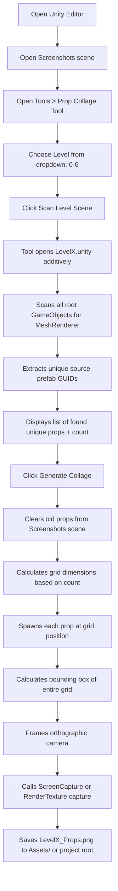

# Plan: Automated Prop Collage Screenshot Tool

## Problem
You have 7 levels (Level 0 - Level 6), each with 50-60 unique prop prefabs scattered across the scene. You need **clean, white-background collage images** (one per level) for your thesis appendix ("LAMPIRAN 3 KOMPONEN GRAFIS OBJEK 3D LINGKUNGAN"). Doing this manually is impractical.

## Solution Overview
Create a **Unity Editor Tool** (C# script in `Assets/Editor/`) that:

1. **Scans** a selected Level scene to discover all unique prop prefabs used
2. **Spawns** each unique prop into your existing `Screenshots` scene in an organized grid layout
3. **Auto-frames** the camera to capture the entire grid
4. **Captures** a single high-resolution screenshot saved as `Level{0-6}_Props.png`

Since scanning the scene for prefab references requires Editor API access (not runtime), this is implemented as an **Editor window** script.

## Architecture

### Files to Create
| File | Purpose |
|------|---------|
| `Assets/Editor/PropCollageTool.cs` | Main Editor window with GUI |
| `Assets/Editor/PropCollageTool.Constants.cs` | Constants: level scene paths, output paths, grid defaults |
| `Assets/Editor/PropCollageTool.LevelScanner.cs` | Scene scanning logic to extract unique prop prefab references |
| `Assets/Editor/PropCollageTool.CollageRenderer.cs` | Grid layout, spawning, camera framing, screenshot capture |

### Files Modified
- The existing `Screenshots` scene needs a reference Camera set to **Orthographic** with **white background** (it's currently Perspective)

## Workflow



## Detailed Implementation

### 1. `PropCollageTool.LevelScanner.cs` - Scene Scanning

- Uses `EditorSceneManager.OpenScene("Assets/Scenes/LevelX.unity")` to open the level
- Iterates all root GameObjects in the scene
- For each GameObject (recursive), checks if there's a `MeshRenderer` or `SkinnedMeshRenderer`
- Uses `PrefabUtility.GetCorrespondingObjectFromSource()` to get the source prefab asset
- Collects unique prefabs into a `HashSet<GameObject>` (by asset GUID)
- Closes the level scene after scanning
- Returns a `List<GameObject>` of unique prop prefabs

**Edge Cases:**
- Duplicate prefab instances (e.g., `SM_Prop_Crate_01` appears 3 times) → deduplicated to 1
- Props with "(1)" suffix that are actually the same prefab → use prefab source comparison, not name
- Wall/floor/environment objects that aren't "props" → filter by name pattern or user can manually exclude
- Nested prefabs → ensure we get the *top-level* prefab asset

### 2. `PropCollageTool.CollageRenderer.cs` - Grid Layout & Screenshot

**Grid Calculation:**
- Configurable `Columns` (default: 10)
- `Rows = Ceiling(Count / Columns)`
- `Spacing` between props (default: 2 units)
- `CellSize` = calculated from the largest prop's bounds

**Prop Spawning:**
- Create an empty "PropCollage" parent GameObject
- For each prop at index `i`:
  - `row = floor(i / Columns)`
  - `col = i % Columns`
  - `x = col * CellSize - (GridWidth / 2)`
  - `z = row * CellSize - (GridHeight / 2)` (or y for vertical grid)
  - Position: `(x, 0, z)` or center each prop at its pivot
  - Rotation: Quaternion.identity or a default angle that shows the prop well
  - Scale: 1 (original)

**Auto-Framing Camera:**
- The existing camera in the Screenshots scene:
  - Change to **Orthographic** mode
  - Set clear flags to **Solid Color**, background **white**
  - Calculate `orthographicSize` = max(GridHeight, GridWidth / aspectRatio) / 2 + padding
  - Position camera above the grid center, pointing down (or at an isometric angle)

**Screenshot Capture:**
- Use `ScreenCapture.CaptureScreenshot("LevelX_Props.png", 2)` (2x supersampling for higher res)
- OR use a RenderTexture with specific 1920x1080 resolution for more control:
  ```
  // Create a temporary RenderTexture
  RenderTexture rt = new RenderTexture(1920, 1080, 24);
  camera.targetTexture = rt;
  camera.Render();
  
  // Read pixels to Texture2D
  RenderTexture.active = rt;
  Texture2D tex = new Texture2D(1920, 1080);
  tex.ReadPixels(new Rect(0, 0, 1920, 1080), 0, 0);
  
  // Save as PNG
  byte[] bytes = tex.EncodeToPNG();
  File.WriteAllBytes("LevelX_Props.png", bytes);
  ```
- Save to `Assets/Screenshots/` or project root

### 3. `PropCollageTool.cs` - Main Editor Window

```csharp
using UnityEditor;
using UnityEngine;

public class PropCollageTool : EditorWindow
{
    private int selectedLevel = 0;
    private int gridColumns = 10;
    private float spacing = 2f;
    private int imageWidth = 1920;
    private int imageHeight = 1080;
    
    private List<GameObject> foundProps = new List<GameObject>();
    private bool hasScanned = false;
    private Vector2 scrollPos;
    
    [MenuItem("Tools/Prop Collage Tool")]
    public static void ShowWindow() => GetWindow<PropCollageTool>("Prop Collage");
    
    void OnGUI()
    {
        // Level selector
        selectedLevel = EditorGUILayout.IntSlider("Level", selectedLevel, 0, 6);
        
        // Scan button
        if (GUILayout.Button("Scan Level Scene")) { ... }
        
        // Show found props
        if (hasScanned) { ... }
        
        // Grid settings
        gridColumns = EditorGUILayout.IntField("Grid Columns", gridColumns);
        spacing = EditorGUILayout.FloatField("Spacing", spacing);
        imageWidth = EditorGUILayout.IntField("Image Width", imageWidth);
        imageHeight = EditorGUILayout.IntField("Image Height", imageHeight);
        
        // Generate button
        GUI.enabled = hasScanned && foundProps.Count > 0;
        if (GUILayout.Button("Generate Collage Screenshot")) { ... }
    }
}
```

### 4. Screenshots Scene Modifications
- Camera **Main Camera (1)** should be set to:
  - Projection: **Orthographic**
  - Clear Flags: **Solid Color**
  - Background: **White** `(#FFFFFF)`
  - Near/Far: 0.3 / 1000
  - Culling Mask: Everything

## Camera Angle Consideration

| Option | Pros | Cons |
|--------|------|------|
| **Top-down** (looking at XZ plane) | Simple, consistent, works for flat props | Side-props show less detail |
| **Isometric ~45° angle** | Shows 3D volume, more informative | Harder to auto-frame, some props may overlap |
| **Front-facing** | Good for wall props | Bad for floor props |

**Recommendation:** Use a **slight isometric angle** (camera rotated ~30° down, looking at origin). This gives a good 3D representation while keeping the collage readable. Each prop can also be individually rotated to face the camera.

## Potential Issues & Mitigations

| Issue | Mitigation |
|-------|------------|
| **Props with emissive materials glow** | Keep as-is (they look fine on white bg) OR add a toggle to override materials with unlit white |
| **Props with transparent materials** | Should render fine with URP |
| **Very large or very small props** | Auto-scale each prop so its bounding box fits within a fixed cell size |
| **Hologram/special shaders** | These may render oddly against white; user can manually disable problematic props |
| **Scene scanning finds non-prop objects** | Filter: only include objects whose prefab path contains "SM_Prop_" or "Prop" |
| **Props with missing meshes** | Skip them gracefully |
| **Collage too large for one screenshot** | Split into multiple grid pages if > 100 props |

## Output Files
```
Level0_Props.png   (1920x1080)
Level1_Props.png   (1920x1080)
Level2_Props.png   (1920x1080)
Level3_Props.png   (1920x1080)
Level4_Props.png   (1920x1080)
Level5_Props.png   (1920x1080)
Level6_Props.png   (1920x1080)
```

Saved to the project root or a `Screenshots/` folder.

## Implementation Steps (Todo)

1. Create `Assets/Editor/PropCollageTool.cs` - Main window with GUI
2. Implement level scanning logic (open scene, find unique props)
3. Implement grid spawning logic (position props in grid)
4. Implement camera framing logic (orthographic, auto-frame)
5. Implement screenshot capture logic (RenderTexture → PNG)
6. Add filtering/configuration options
7. Test with Level 0 (verify the props listed by user appear correctly)
8. Generate all 7 level collage images
